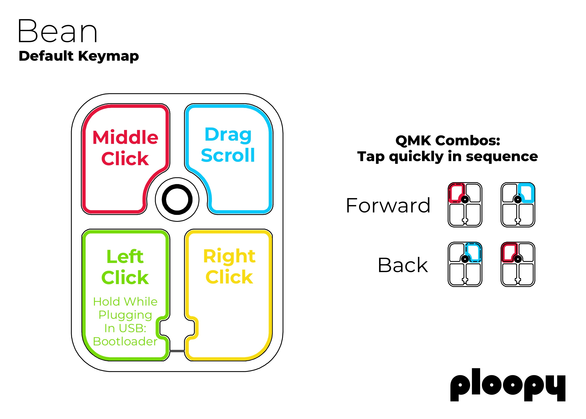

# Appendix E: Default Keymap

The default keymap for the Bean is as follows.

All of these functions can be customized using [VIA, a free open-source webapp](https://usevia.app).

Note that your browser needs to support WebHID in order to use VIA.