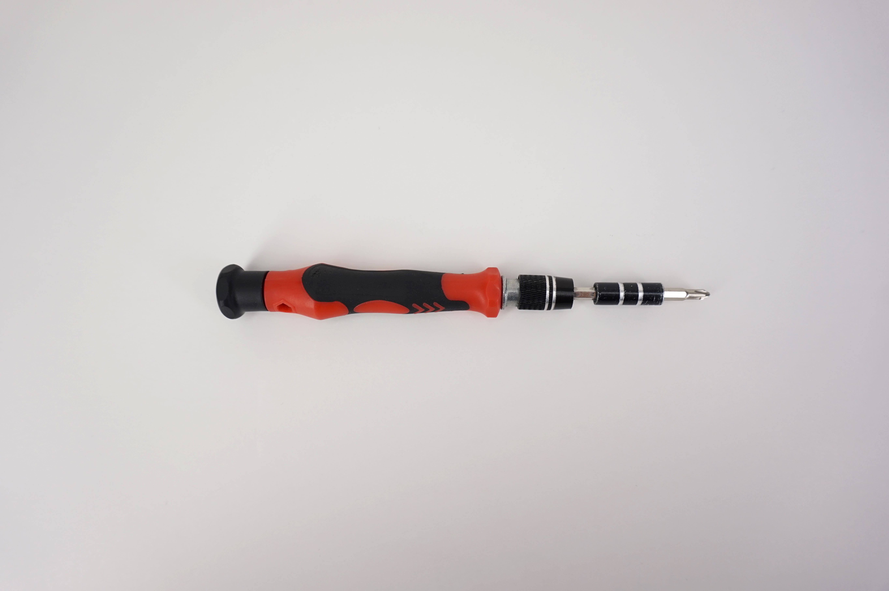
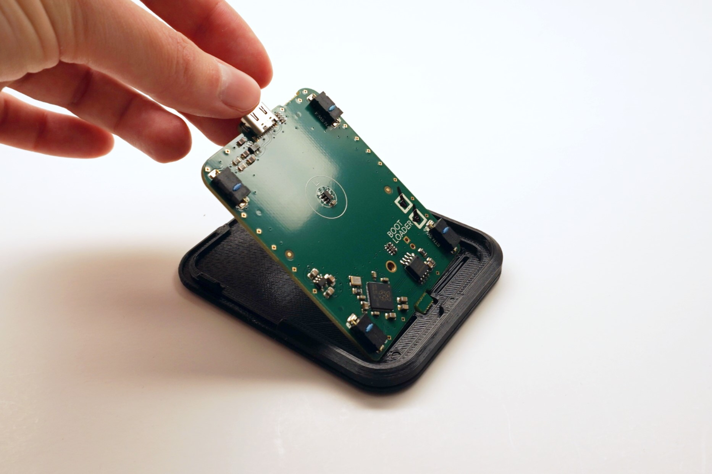
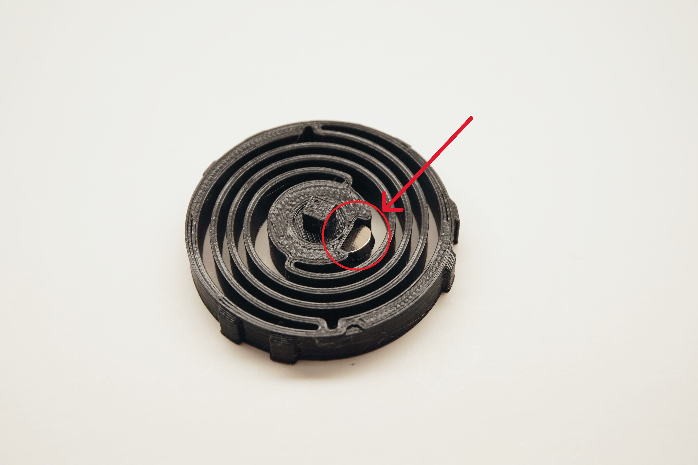
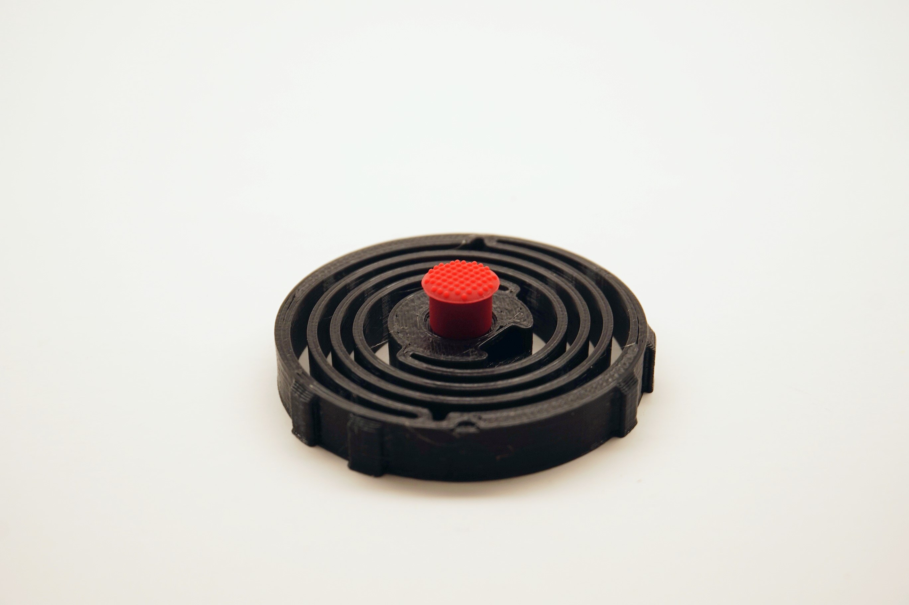
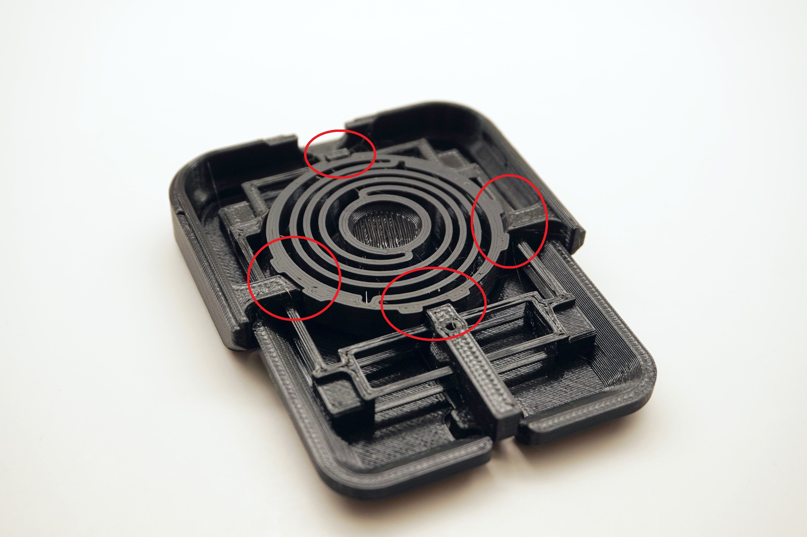
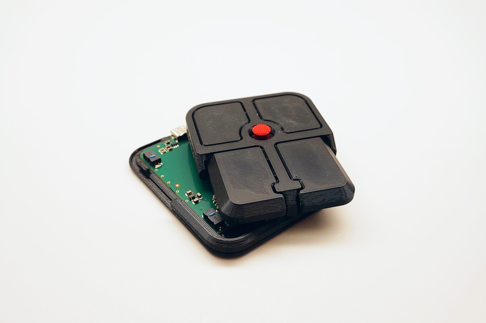
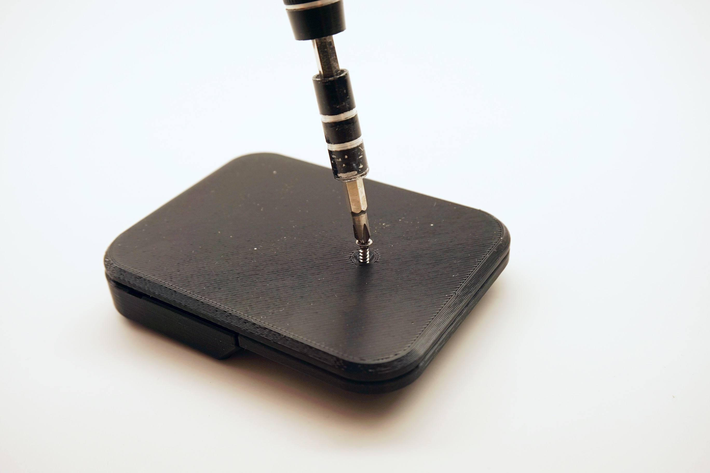
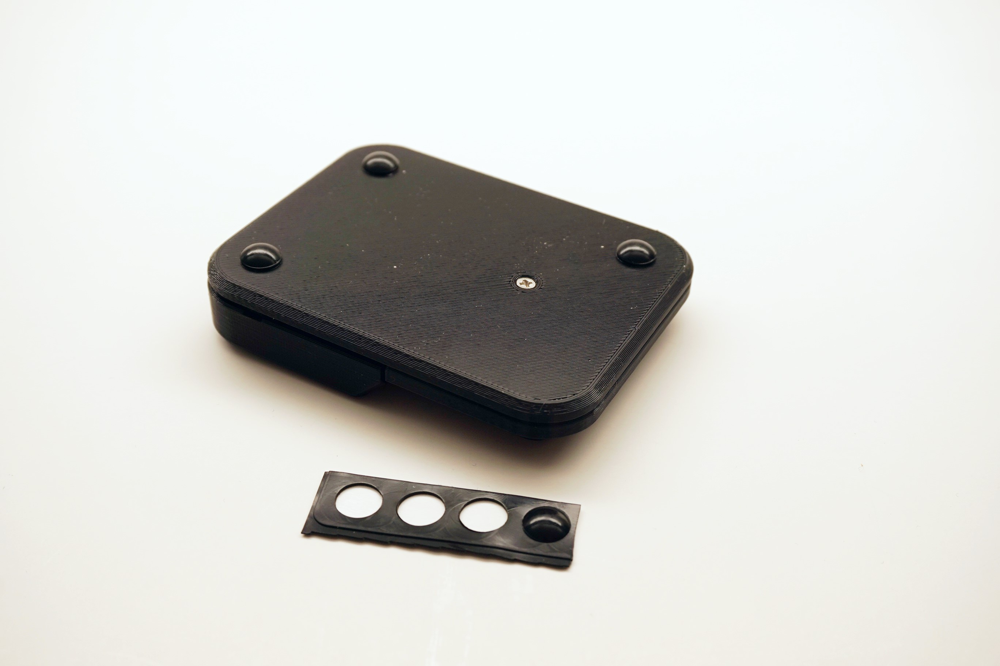
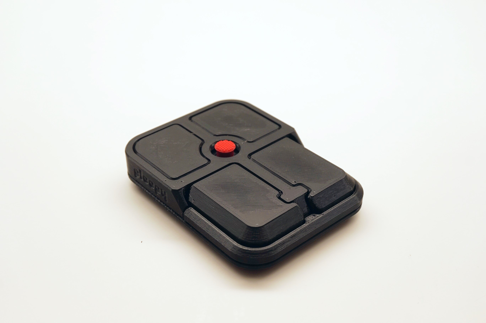

## Step 1: Prepare necessary tools

- A #1 Phillips head screwdriver

## Step 2: Place PCB into Base

  💡
  <strong>Tip:</strong> The PCB may require a bit of force to get in.

## Step 3: Insert Magnet into Spring

  💡
  <strong>Tip:</strong> The magnet must be inserted with the <b>north</b> side facing <b>upwards</b>. Use a compass to determine the orientation of the magnet.

- The magnet requires a bit of force to fully insert.
- Once inserted, the Magnet will be very difficult to remove.

## Step 4: Place Friction Nub onto Spring

- If you want to 3D-print your own nub, you can use [this free design to do so](https://makerworld.com/en/models/483268-trackpoint-cap-for-thinkpad-keyboard#profileId-402360).

## Step 5: Place Spring into Top

  💡
  <strong>Tip:</strong> The Spring must be oriented correctly in order to properly insert. See the photo for details.

## Step 6: Place Top onto Base

  💡
  <strong>Tip:</strong> The Top should snap into place on the Base.

## Step 7: Screw Top to Base

## Step 8: Place Friction Pads on Base

## Step 9: All done!

## Post Build Steps:

### Verify the device is working correctly

- Plug the Bean into the computer using a USB-C cable
- Move the nub around, it should move the cursor
- Press each of the buttons to verify their function

  ℹ️
  <strong>Info:</strong> The default keymap for the Bean is <a href="../appendices/keymap/">here</a>.

### Check out Post Build FAQ
- [Post Build FAQ](https://help.ploopy.co/?docs=where-can-i-find-mods-for-my-ploopy-device)
- Contains various information about things you can do after initial assembly!

  ℹ️
  <strong>Info:</strong> If the device is not working, consult our <a href="https://help.ploopy.co/checklist-v2/">troubleshooting guide</a> for further steps.

<!--

  💡
  <strong>Tip:</strong> Here's an interesting piece of info!

  🚨
  <strong>Warning:</strong> Here's a warning!

  ℹ️
  <strong>Info:</strong> Here's some cool stuff!

-->
